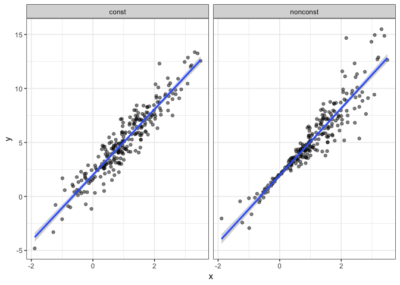
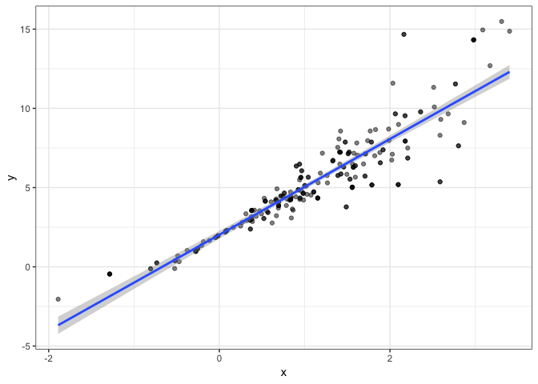
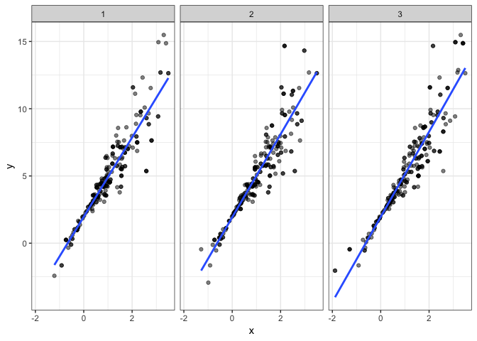

bootstrapping
================
Guojing Wu
2018/11/15

bootstrapping in SLR
--------------------

``` r
n_samp = 250

sim_df_const = 
  tibble(
    x = rnorm(n_samp, 1, 1),
    error = rnorm(n_samp, 0, 1),
    y = 2 + 3 * x + error
  )

sim_df_nonconst = sim_df_const %>% 
  mutate(
  error = error * .75 * x,
  y = 2 + 3 * x + error
)

sim_df = 
  bind_rows(const = sim_df_const, nonconst = sim_df_nonconst, .id = "data_source") 
```

plot it

``` r
sim_df %>% 
  ggplot(aes(x = x, y = y)) + 
  geom_point(alpha = .5) +
  stat_smooth(method = "lm") +
  facet_grid(~data_source)
```



let's look at the summary

``` r
lm(y ~ x, data = sim_df_const) %>% 
  broom::tidy() %>% 
  knitr::kable(digits = 3)
```

| term        |  estimate|  std.error|  statistic|  p.value|
|:------------|---------:|----------:|----------:|--------:|
| (Intercept) |     1.977|      0.098|     20.157|        0|
| x           |     3.045|      0.070|     43.537|        0|

``` r
lm(y ~ x, data = sim_df_nonconst) %>% 
  broom::tidy() %>% 
  knitr::kable(digits = 3)
```

| term        |  estimate|  std.error|  statistic|  p.value|
|:------------|---------:|----------:|----------:|--------:|
| (Intercept) |     1.934|      0.105|     18.456|        0|
| x           |     3.112|      0.075|     41.661|        0|

Since we don't know about the theoretical distribution, now it's time for bootstrapping, we get to see waht will happen if some of the observations appear too mant times or what will happen if some of the observations don't even show up (aka the variance of this sample):
-------------------------------------------------------------------------------------------------------------------------------------------------------------------------------------------------------------------------------------------------------------------------------

one-time bootstrap, not too much info

``` r
boot_sample = function(df) {
  sample_frac(df, replace = TRUE) # sampling with the same size as the original sample
}

boot_sample(sim_df_nonconst) %>% 
  ggplot(aes(x = x, y = y)) + 
  geom_point(alpha = .5) +
  stat_smooth(method = "lm")
```



now we try 1000 times, and do a few check:

``` r
boot_straps = data_frame(
  strap_number = 1:1000,
  strap_sample = rerun(1000, boot_sample(sim_df_nonconst))
)

boot_straps %>% 
  filter(strap_number %in% 1:2) %>% 
  mutate(strap_sample = map(strap_sample, ~arrange(.x, x))) %>% # arrange by x
  pull(strap_sample)
```

    ## [[1]]
    ## # A tibble: 250 x 3
    ##         x   error       y
    ##     <dbl>   <dbl>   <dbl>
    ##  1 -1.21  -0.781  -2.43  
    ##  2 -0.914 -0.908  -1.65  
    ##  3 -0.914 -0.908  -1.65  
    ##  4 -0.733  0.447   0.248 
    ##  5 -0.733  0.447   0.248 
    ##  6 -0.733  0.447   0.248 
    ##  7 -0.733  0.447   0.248 
    ##  8 -0.641 -0.416  -0.338 
    ##  9 -0.606 -0.106   0.0774
    ## 10 -0.536  0.0227  0.413 
    ## # ... with 240 more rows
    ## 
    ## [[2]]
    ## # A tibble: 250 x 3
    ##         x   error      y
    ##     <dbl>   <dbl>  <dbl>
    ##  1 -1.29   1.40   -0.454
    ##  2 -0.989 -1.97   -2.93 
    ##  3 -0.914 -0.908  -1.65 
    ##  4 -0.805  0.292  -0.123
    ##  5 -0.733  0.447   0.248
    ##  6 -0.733  0.447   0.248
    ##  7 -0.733  0.447   0.248
    ##  8 -0.665 -0.544  -0.539
    ##  9 -0.536  0.0227  0.413
    ## 10 -0.536  0.0227  0.413
    ## # ... with 240 more rows

draw the plot

``` r
boot_straps %>% 
  filter(strap_number %in% 1:3) %>% 
  unnest() %>% 
  ggplot(aes(x = x, y = y)) + 
  geom_point(alpha = .5) +
  stat_smooth(method = "lm", se = FALSE) +
  facet_grid(~strap_number) 
```



analyze the 1000 times result and get its standard error

``` r
bootstrap_results = 
  boot_straps %>% 
  mutate(models = map(strap_sample, ~lm(y ~ x, data = .x) ),
         results = map(models, broom::tidy)) %>% 
  select(-strap_sample, -models) %>% 
  unnest() %>% 
  group_by(term) %>% 
  summarize(boot_se = sd(estimate))

bootstrap_results %>% 
  knitr::kable(digits = 3)
```

| term        |  boot\_se|
|:------------|---------:|
| (Intercept) |     0.077|
| x           |     0.106|
